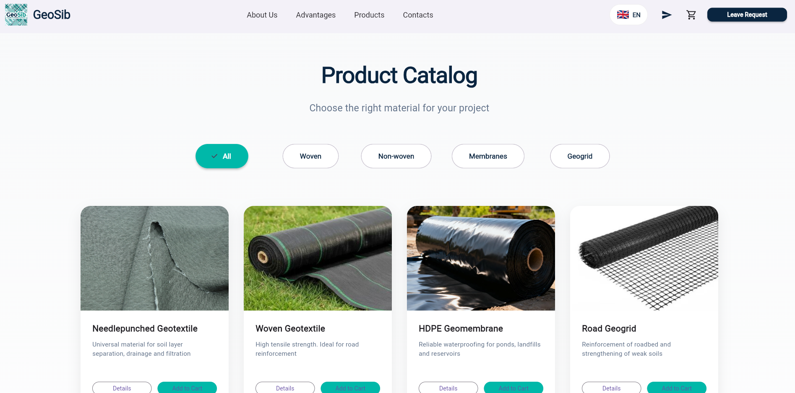
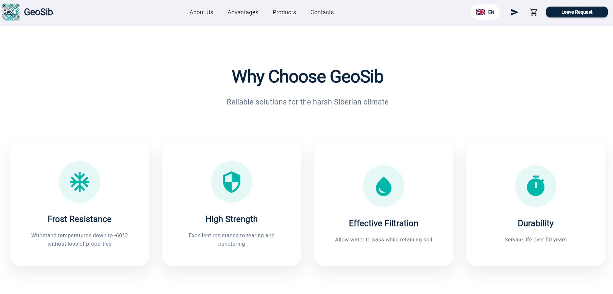
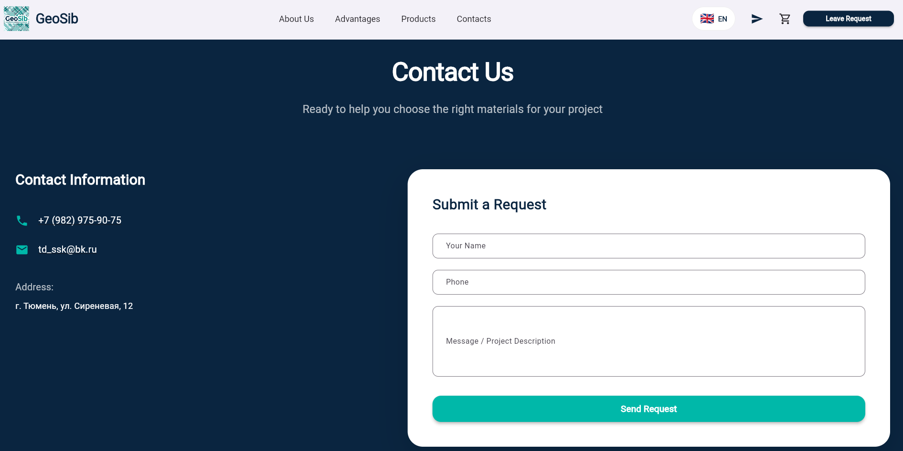
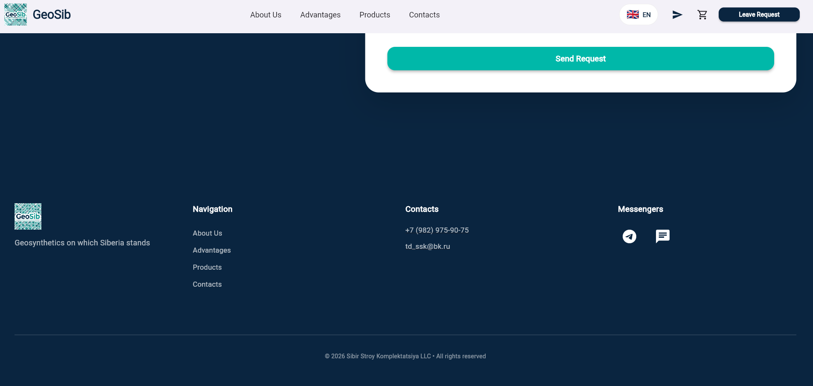
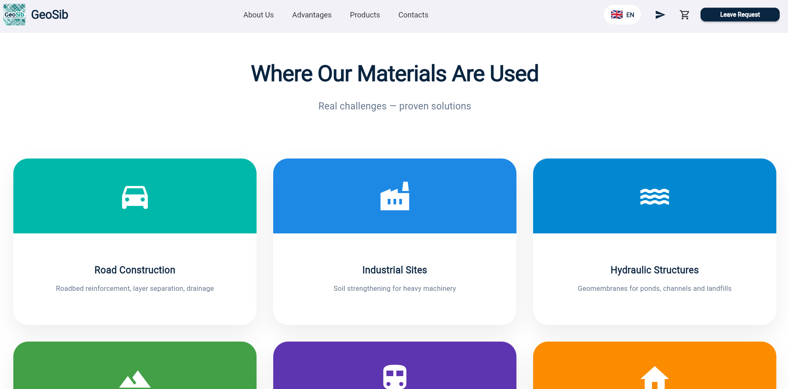
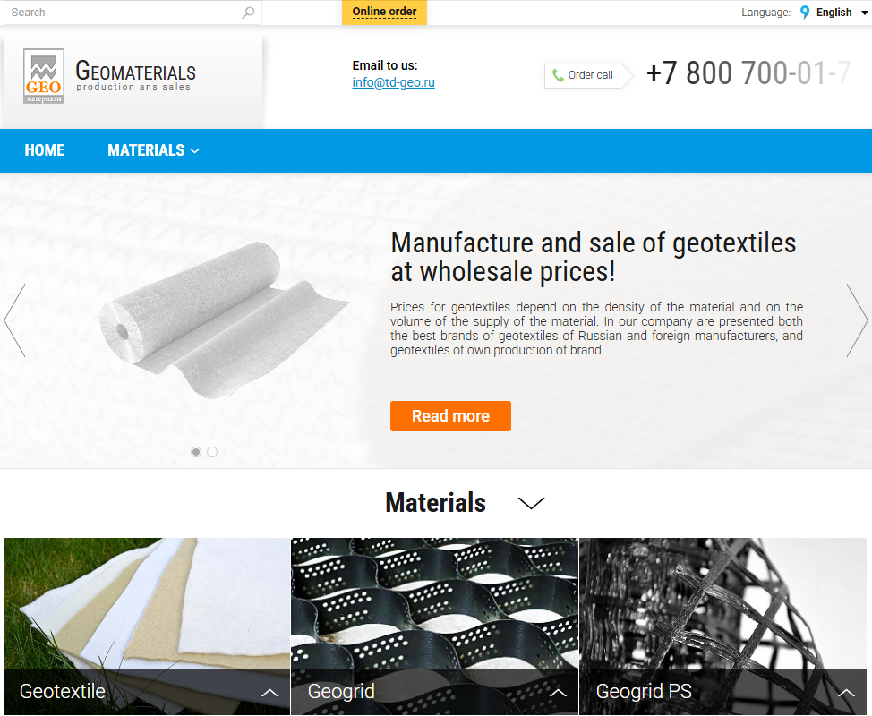

# GeoTextile — Flutter Web E-commerce Website

**Redesigned responsive Flutter Web application for selling geotextile materials**  
*Real client project • Before → After transformation*


---

## 📋 Overview

This is a complete redesign of an existing geotextile sales website, rebuilt as a modern **Flutter Web** application. The original site had lost its domain, so I developed a clean, professional, and fully responsive web application focused on great user experience and business goals.

**Objective:** Create a trustworthy, fast, and beautiful web presence that works seamlessly across all devices.

---

## 🖼️ Before & After

### New Design (Flutter Web)
| Hero Section               | Products                   | Advantages                  |
|----------------------------|----------------------------|-----------------------------|
|  |  |  |

| Contacts                        | Footer                        | Where it's used                  |
|---------------------------------|-------------------------------|----------------------------------|
|  |  |  |

### Old Version (for comparison)


---

## ✨ Key Features & Improvements

- Built with **Flutter Web** for excellent performance and consistency
- Fully responsive and mobile-first design
- Modern, clean, and professional UI/UX
- Clear product presentation and visual hierarchy
- Dedicated advantages section with icons
- Functional contact form
- Fast loading and optimized for the web
- Significant improvement in visual quality and user experience

---

## 🛠️ Tech Stack

- **Flutter** (Dart)
- Flutter Web for cross-platform web deployment
- Responsive design principles
- Clean architecture suitable for future mobile expansion

> Flutter Web application — can be deployed to GitHub Pages, Vercel, Firebase Hosting, or any static hosting.

---

## 🚀 Getting Started

```bash
# Clone the repository
git clone https://github.com/Bobidze/geotextile-website.git
cd geotextile-website

# Get dependencies
flutter pub get

# Run in Chrome
flutter run -d chrome

# Build for production web
flutter build web
```

---

## 🎯 Purpose

- Real client project developed for a family geotextile business
- Demonstrates ability to deliver a full redesign using modern cross-platform technology (Flutter Web)
- Showcases skills in responsive design, clean code, and business-oriented development
- Strong portfolio piece for Flutter and frontend opportunities

---

## 🔒 License & Usage

**Copyright © 2026 Nikita Tarasyuk. All rights reserved.**

This project was developed as a real client redesign. The source code is shared publicly **for portfolio and educational purposes only**.

Unauthorized copying, reproduction, modification, distribution, or commercial use of this project (or any substantial portion thereof) is strictly prohibited without prior written permission from the author.

For licensing inquiries, please contact: tarasyuk.nikita020206@gmail.com

See the [LICENSE](LICENSE) file for the full terms.

---

## 👤 About the Author

**Nikita Tarasyuk**  
Junior Flutter & Frontend Developer  

Computer Science student (1st year) at Shanghai Electric Power University.  
Passionate about building beautiful and functional web & mobile applications with Flutter.

- GitHub: [github.com/Bobidze](https://github.com/Bobidze)
- Telegram: [@meowuchkin](https://t.me/meowuchkin)
- Email: tarasyuk.nikita020206@gmail.com

*Open to freelance opportunities and interesting projects.*

---

*Built with care for a real business using Flutter. Always looking to create and improve.*