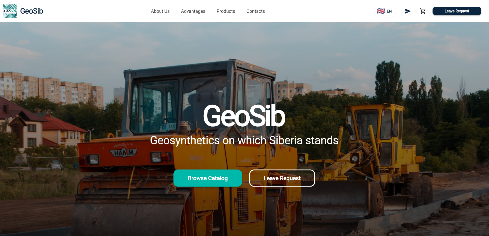

# GeoTextile — Modern E-commerce Website

**Redesigned responsive website for selling geotextile materials**  
*Real client project • Before → After transformation*



---

## 📋 Overview

This project is a complete redesign of an existing website for a geotextile sales business. The original site had lost its domain, so I rebuilt it from the ground up as a clean, modern, mobile-first landing page focused on professionalism, usability, and conversion.

**Objective:** Transform an outdated basic site into a trustworthy online presence that performs well on all devices and clearly presents products and benefits.

---

## 🖼️ Before & After

### New Design (2026)
| Hero Section          | Products              | Advantages             |
|-----------------------|-----------------------|------------------------|
|  |  |  |

| Contacts                  | Footer                    | Where it's used           |
|---------------------------|---------------------------|---------------------------|
|  |  |      |

### Old Version (for comparison)


---

## ✨ Key Improvements & Features

- Fully responsive and mobile-first design
- Modern, clean, and professional UI/UX
- Clear visual hierarchy for products and benefits
- Dedicated advantages section with icons
- Functional contact form area
- Fast loading and SEO-friendly structure
- Significant improvement in visual appeal and perceived professionalism

---

## 🛠️ Tech Stack

- HTML5 + CSS3 + JavaScript
- Tailwind CSS
- Mobile-first responsive development
- Lightweight and performant (no unnecessary frameworks)

> Static website — ready for deployment on GitHub Pages, Vercel, or Netlify.

---

## 🚀 Getting Started

Clone the repository and open `index.html` in your browser:

```bash
git clone https://github.com/Bobidze/geotextile-website.git
cd geotextile-website
# Open index.html in any browser
```

---

## 🎯 Purpose

- Real client project created for a family business
- Demonstrates ability to take an existing website and deliver a major design and UX upgrade
- Showcases frontend skills: responsive layouts, clean code, business-focused improvements
- Strong addition to a portfolio for freelance and junior developer opportunities

---

## 👤 About the Author

**Nikita Tarasyuk**  
Junior Flutter & Frontend Developer  

Computer Science student (1st year) at Shanghai Electric Power University.  
Passionate about creating beautiful, functional web and mobile applications.

- GitHub: [github.com/Bobidze](https://github.com/Bobidze)
- Telegram: [@meowuchkin](https://t.me/meowuchkin)
- Email: tarasyuk.nikita020206@gmail.com

*Open to freelance opportunities and interesting projects.*

---

*Built with care for a real business. Always looking to create and improve.*